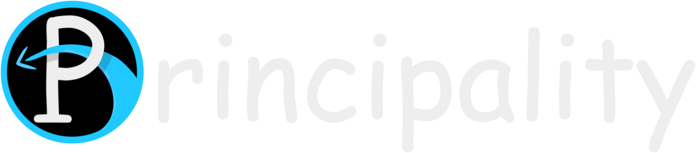

  

  
  
  
  <a href="https://go.deta.dev/deploy?repo=https://github.com/Soumeh/Principality-Next"><a/>

---

**Principality** is a Discord Bot framework made in Python using the [nextcord](https://nextcord.dev/) library.

By itself, a **Principality** bot is functionless, its main purpose is to load **Cogs**, which give the bot functionality.

## Table of Contents
- [Usage](#usage)
  - [Installing Cogs](#installing-cogs)
  - [Configuring Cogs](#configuring-cogs)
  - [Running the Bot](#running-the-bot)
- [Development](#development)
  - [Development Mode](#development-mode)
  - [Making Cogs](#making-cogs)

# Usage

## Installing Cogs

W.I.P.

## Configuring Cogs

W.I.P.

## Running the Bot

W.I.P.

# Development

## Development Mode

W.I.P.

## Making Cogs

W.I.P.